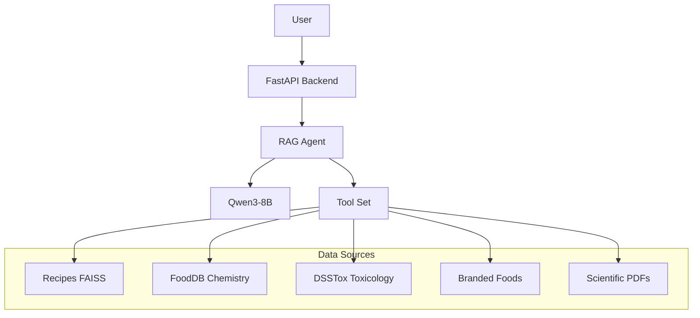

# Nutri-AI Documentation Overview

## 1. Project Purpose
Nutri-AI is an advanced culinary intelligence system that combines:
- **RAG (Retrieval-Augmented Generation)**: Access to scientific papers, toxicology data, and food chemistry.
- **LLM (Qwen3-8B)**: A local, privacy-focused Large Language Model for reasoning and generation.
- **Agentic Workflow**: Tools for pantry management, recipe invention, and dietary analysis.

## 2. System Architecture

## 3. Key Subsystems
- **Multi-Source RAG**: Intelligently routes queries to the most relevant database (e.g., "nutrition" -> Branded Foods, "toxicity" -> DSSTox).
- **Chemistry Engine**: Maps ingredients to chemical compounds to identify health benefits and risks.
- **Recipe Inventor**: Generates scientifically-grounded recipes based on available ingredients and constraints.

## 4. Setup Instructions
1. **Install Dependencies**: `pip install -r requirements.txt`
2. **Download Models**: `python scripts/download_model.py`
3. **Build Indices**: `python scripts/rebuild_faiss_bge.py`
4. **Start Server**: `./start_server.sh`

## 5. Documentation Map
- **[Project Structure](docs/auto_structure/PROJECT_STRUCTURE.md)**: Detailed file-by-file breakdown.
- **[Data Pipelines](docs/data_pipeline/DATA_SOURCES.md)**: Source tracking and index status.
- **[Models](docs/models/llm_and_rag.md)**: LLM and Embedding model configurations.
- **[Dependencies](docs/architecture/dependencies.md)**: Module interaction graph.
