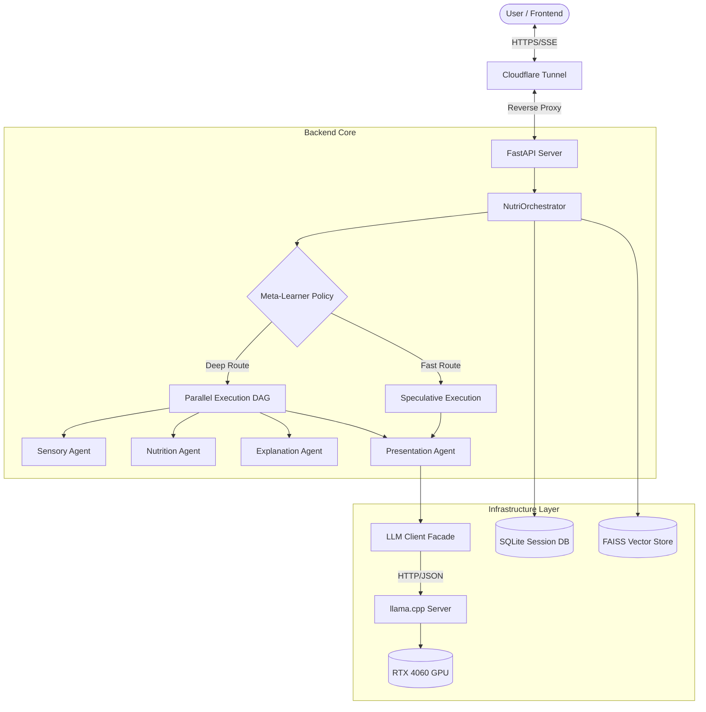
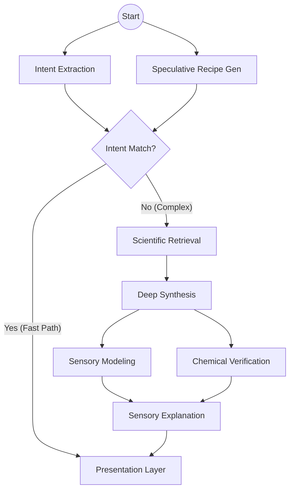
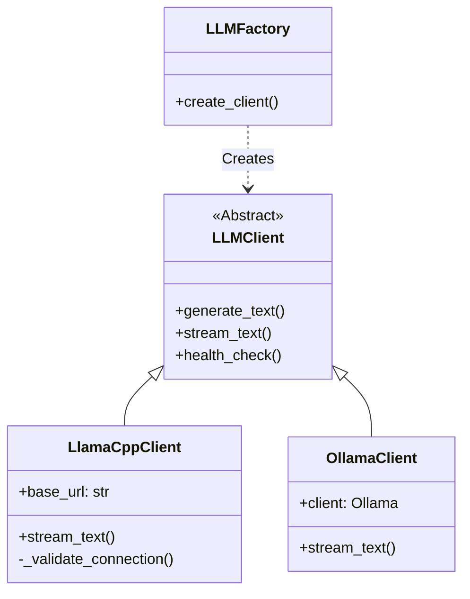
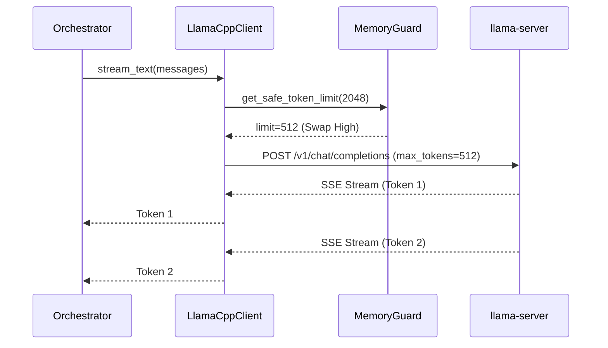

# Nutri AI - Production Architecture (v2.0)

## 1. Executive Overview

Nutri is a **deterministic, tiered, and agentic** food intelligence system.
Unlike generic chatbots, it uses a **Hybrid Reasoning Engine** that combines a sub-1ms Meta-Learner policy with a Parallel Execution DAG to deliver instant culinary guidance followed by deep scientific validation.

**Key Capabilities:**
- **Zero-Latency Response**: Speculative execution streams recipes in <3s.
- **Scientific Grounding**: 13-phase validation pipeline (Chemistry, Sensory, Nutrition).
- **Resource Aware**: Deterministic `MemoryGuard` prevents crashes on consumer hardware (RTX 4060).
- **Runtime Agnostic**: Runs via `llama.cpp` (production) or `Ollama` (dev).

---

## 2. High-Level System Map



---

## 3. Cognitive Architecture (The "Brain")

### 3.1 Meta-Learner (Policy Layer)
Before any heavy computation, the **Meta-Learner** decides the strategy in <1ms based on intent and system load.

```mermaid
flowchart LR
    Input[User Query] --> Learner{Meta-Learner}
    Metrics[System Metrics (RAM/Swap)] --> Learner
    
    Learner -- "Simple Intent + Low Load" --> Fast[FAST Profile]
    Learner -- "Sensory Keywords" --> Sensory[SENSORY Profile]
    Learner -- "Optimization Keywords" --> Opt[OPTIMIZE Profile]
    Learner -- "Critical Load" --> Fallback[Downgrade to FAST]
    
    Fast --> Spec[Launch Speculative Task]
    Sensory --> Parallel[Launch Parallel DAG]
    Opt --> Deep[Launch Deep Frontier Search]
```

### 3.2 Parallel Execution DAG
Complex requests trigger a directed acyclic graph of agents to maximize throughput.



---

## 4. LLM Runtime & Abstraction

To support the RTX 4060 (8GB VRAM), we migrated from Ollama to a dedicated `llama.cpp` server with a strict Abstraction Layer.

### 4.1 Interface Design


### 4.2 Sequence Diagram


---

## 5. Deployment Specs

### Hardware Constraints
- **GPU**: NVIDIA RTX 4060 (8GB VRAM)
- **RAM**: 16GB System RAM
- **Model**: `qwen3-8b-q4_k_m.gguf` (Quantized to 5.8GB)
- **Context Config**: `-c 8192 -ngl 35` (Offload 35 layers to GPU)

### Service Stack
| Component | Function | Port/Path |
|-----------|----------|-----------|
| **llama-server** | LLM Inference | `127.0.0.1:8081` |
| **FastAPI** | Logic & Orchestration | `0.0.0.0:8000` |
| **Cloudflare** | Secure Tunnel | `chatdps.dpdns.org` |
| **SQLite** | Session Storage | `nutri_sessions.db` |

### Execution Profiles
| Profile | Description | Target Latency | Phases |
|---------|-------------|----------------|--------|
| **FAST** | Speculative recipe generation | <3s (First Token) | Intent, Synth |
| **SENSORY** | Adds texture/flavor modeling | <15s | +Sensory, Explain |
| **OPTIMIZE** | Multi-objective optimization | ~60s | +Frontier, Selection |

---

## 6. Stability Mechanisms

### Memory Guard
- **Trigger**: Swap Usage > 1.5GB
- **Action**: CAPS `max_tokens` to 512, Downgrades `OPTIMIZE` -> `FAST`.
- **Logic**: `backend/memory_guard.py`

### SSE Heartbeats
- **Problem**: long generation phases (e.g., Optimization) cause timeouts.
- **Solution**: Orchestrator emits `{"type": "status"}` events every 2s if no tokens are generated.

### Speculative Race
- **Risk**: Intent Extraction is slow (Parsing JSON).
- **Fix**: We launch a generic recipe generation *in parallel* with intent extraction. If the extracted intent confirms "standard meal", we use the already-generating recipe.

---

**Version**: 2.0.0
**Last Updated**: Jan 2026
